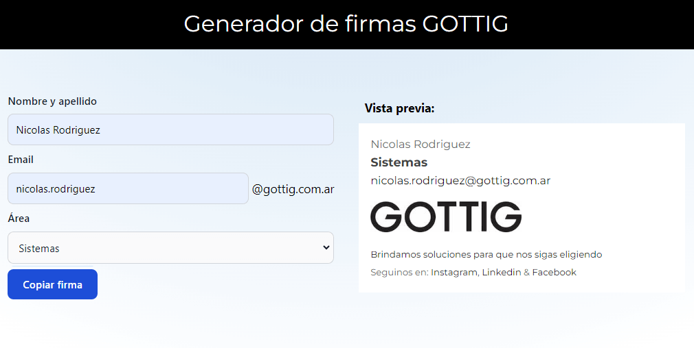

# Generador de firmas de correo electrónico Gottig

Este proyecto te permite crear fácilmente firmas de correo electrónico personalizadas con tu nombre, apellido, correo electrónico y sector al que perteneces. Además, incluye la funcionalidad de mostrar automáticamente la imagen correspondiente al sector seleccionado.

## ¿Cómo funciona?

- Ingresa tu nombre y apellido, correo electrónico y selecciona tu sector.
- Haz clic en el botón "Copiar Firma".
- ¡Listo! Tu firma de correo electrónico estará disponible para copiar y pegar donde lo necesites.

###

